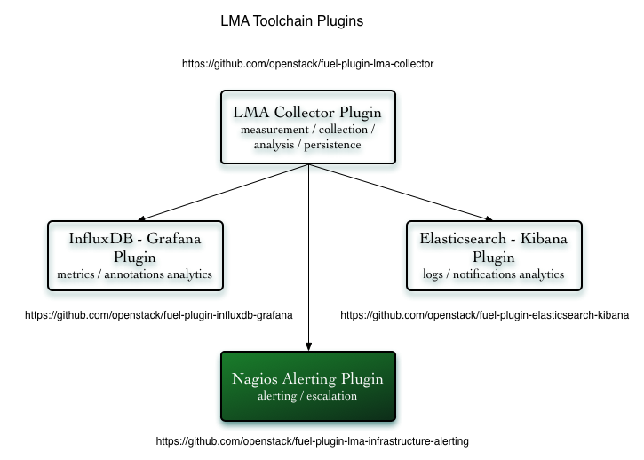

.. _user_overview:

Overview
========

The **LMA Infrastructure Alerting Plugin** is used to install and configure
Nagios which provides the alerting and escalation functionalities of the LMA
Toolchain.

Nagios is a key component of the `LMA Toolchain project <https://launchpad.net/lma-toolchain>`_
as shown in the figure below.

.. _plugin_requirements:

Requirements
------------

+----------------------------------+---------------------------------------------------------+
| Requirement                      | Version/Comment                                         |
+==================================+=========================================================+
| Fuel                             | Mirantis OpenStack 7.0                                  |
+----------------------------------+---------------------------------------------------------+
| The LMA collector Fuel plugin    | At least 0.8.0                                          |
+----------------------------------+---------------------------------------------------------+
| The InfluxDB-Grafana Fuel plugin | At least 0.8.0                                          |
|                                  |                                                         |
|                                  | This is optional and only needed if you want to trigger |
|                                  | alarms from InfluxDB data.                              |
+----------------------------------+---------------------------------------------------------+

Limitations
-----------

A current limitation of this plugin is that it not possible to display in the Fuel web UI,
the URL where the Nagios interface can be reached when the deployment has completed.
Instructions are provided in the :ref:`user_guide` about how you can
obtain this URL using the `fuel` command line.
