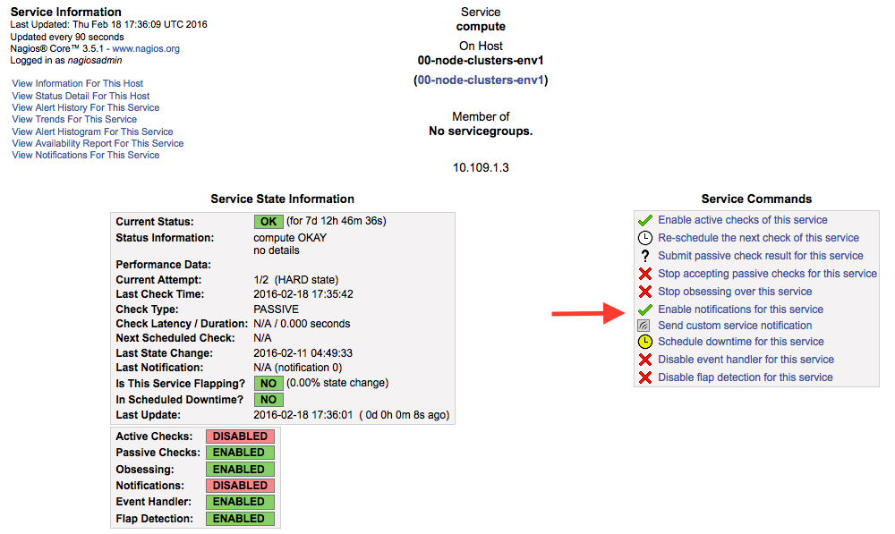

.. _user_guide:

User Guide
==========

.. _plugin_configuration:

Plugin configuration
--------------------

To configure your plugin, you need to follow these steps:

1. `Create a new environment <http://docs.mirantis.com/openstack/fuel/fuel-8.0/user-guide.html#launch-wizard-to-create-new-environment>`_
   with the Fuel web user interface.

#. Click the **Settings** tab and select the **Other** category.

#. Scroll down through the settings until you find the **LMA Infrastructure Alerting
   Plugin** section. You should see a page like this.

   .. image:: ../images/lma_infrastructure_alerting_settings.png
      :width: 800
      :align: center

#. Check the *LMA Infrastructure Alerting Plugin* box and fill-in the required fields
   as indicated below.

   a. Change the Nagios web interface password (recommended).
   #. Check the boxes corresponding to the type of notification you would
      like to be alerted for by email (*CRITICAL*, *WARNING*, *UNKNOWN*, *RECOVERY*).
   #. Specify the recipient email address for the alerts.
   #. Specify the sender email address for the alerts.
   #. Specify the SMTP server address and port.
   #. Specify the SMTP authentication method.
   #. Specify the SMTP username and password (required if the authentication method isn't *None*).

#. When you are done with the settings, scroll down to the bottom of the page and click
   the **Save Settings** button.

#. Click the *Nodes* tab and assign the *LMA Infrastructure Alerting* role to nodes
   as shown below. You can see in this example that the *Infrastructure_Alerting*
   role is assigned to three different nodes along with the *Elasticsearch_Kibana* role
   and the *InfluxDB_Grafana* role. This means that the three plugins of the LMA toolchain
   can be installed on the same nodes.

   .. image:: ../images/lma_infrastructure_alerting_role.png
      :width: 800
      :align: center

   .. note:: You can assign the *Infrastructure_Alerting* role up to three nodes.
      Nagios clustering for high availability requires that you assign
      the *Infrastructure_Alerting* role to at least three nodes. Note also that
      it is possible to add or remove a node with the *Infrastructure_Alerting*
      role after deployment.

#. Click on **Apply Changes**.

#. Adjust the disk configuration if necessary (see the `Fuel User Guide
   <http://docs.mirantis.com/openstack/fuel/fuel-8.0/user-guide.html#disk-partitioning>`_
   for details). By default, the *LMA Infrastructure Alerting Plugin* allocates:

     * 20% of the first available disk for the operating system by honoring a range of
       15GB minimum and 50GB maximum,
     * 10GB for */var/log*,
     * At least 20 GB for the Nagios data in */var/nagios*.

#. `Configure your environment <http://docs.mirantis.com/openstack/fuel/fuel-8.0/user-guide.html#configure-your-environment>`_
   as needed.

#. `Verify the networks <http://docs.mirantis.com/openstack/fuel/fuel-8.0/user-guide.html#verify-networks>`_
   on the Networks tab of the Fuel web UI.

#. And finally, `Deploy <http://docs.mirantis.com/openstack/fuel/fuel-8.0/user-guide.html#deploy-changes>`_ your changes.

.. _plugin_install_verification:

Plugin verification
-------------------

Be aware, that depending on the number of nodes and deployment setup,
deploying a Mirantis OpenStack environment can typically take anything
from 30 minutes to several hours. But once your deployment is complete,
you should see a deployment success notification message with
a link to the Nagios dashboard as shown below.

.. image:: ../images/deployment_notification.png
   :align: center
   :width: 800

From the Fuel web UI **Dashboard** view, click on the **Nagios** link.
Once you have authenticated (username is ``nagiosadmin`` and the
password is defined in the settings of the plugin), you should be directed to
the *Nagios Home Page* as shown below.

.. note:: Be aware that Nagios is attached to the *management network*.
   Your desktop machine must have access to the OpenStack environment's
   *management network* you just created to get access to the Nagios dashboard.

.. image:: ../images/nagios_homepage.png
   :align: center
   :width: 800

Managing Nagios
---------------

You can get the current status of the OpenStack environment by clicking on
the *Services* menu item as shown below.

.. image:: ../images/nagios_services.png
   :align: center
   :width: 800

The *LMA Infrastructure Alerting Plugin* configures Nagios for all the
hosts and services that have been deployed in the environment. The alarms (or
service checks in Nagios terms) are created in **passive mode** as
they are received from the *LMA Collector* and *Aggregator* (see the `LMA
Collector documentation <http://fuel-plugin-lma-collector.readthedocs.org/>`_
for more details).

.. note:: The alert notifications for the nodes and clusters of nodes are
   disabled by default to avoid the alert fatigue and because they are not
   necessarily indicative of a condition affecting the overall health state
   of an OpenStack service cluster. If you nonetheless want to enable those alerts,
   go to the service details page and click on the *Enable notifications
   for this service* link within the *Service Commands* panel as shown below.

There are also two *Virtual Hosts* representing the health state of the
*service clusters* and *node clusters*:

  * *00-global-clusters-env${ENVID}* for the service clusters like the Nova
    cluster, the Keystone cluster, the RabbiMQ cluster and so on.

  * *00-node-clusters-env${ENVID}* for the physical node clusters like the
    cluster of controller nodes, the cluster of storage nodes and so on.

These *Virtual Hosts* entities offer a high-level health state view for
those clusters in the OpenStack environment.

Configuring service checks on InfluxDB metrics
----------------------------------------------

You can configure additional alarms (other than those already defined in the
*LMA Collector*) based on the metrics stored in the InfluxDB database. You
can, for example, define an alert to be notified when the CPU activity for a
particular process crosses a particular threshold.
Say for example, you would like to set a 'warning'
alarm at 30% of system CPU usage and a 'criticial' alarm at 50% system CPU usage for the
Elasticsearch process.
The steps to define those alarms in Nagios would be as follow:

#. Connect to the *LMA Infrastructure Alerting* node.

#. Install the Nagios plugin for querying InfluxDB::

    [root@node-13 ~]# pip install influx-nagios-plugin

#. Define the command and the service check in the ``/etc/nagios3/conf.d/influxdb_services.conf`` file::

    # Replace <INFLUXDB_HOST>, <INFLUXDB_USER> and <INFLUXDB_PASSWORD> by
    # the appropriate values for your deployment
    define command {
      command_line /usr/local/bin/check_influx \
          -h <INFLUXDB_HOST> -u <INFLUXDB_USER> -p <INFLUXDB_PASSWORD> -d lma \
          -q "select max(value) from lma_components_cputime_syst \
          where time > now() - 5m and service='$ARG1$' \
          group by time(5m) limit 1" \
          -w $ARG2$ -c $ARG3$
      command_name check_cpu_metric
    }

    define service {
      service_description Elasticsearch system CPU
      host                node-13
      check_command       check_cpu_metric!elasticsearch!30!50:
      use                 generic-service
    }

#. Verify that the Nagios configuration is valid::

    [root@node-13 ~]# nagios3 -v /etc/nagios3/nagios.cfg

       [snip]

    Total Warnings: 0
    Total Errors:   0

  Here, things look okay. No serious problems were detected during the pre-flight check.

5. Restart the Nagios server,::

    [root@node-13 ~]# /etc/init.d/nagios3 restart

#. Go the Nagios dashboard and verify that the service check has been added.

From there, you can define additional service checks for different hosts or
host groups using the same ``check_influx`` command.
You will just need to provide these three required arguments for defining new service checks:

  * A valid InfluxDB query that should return only one row with a single value.
    Check the `InfluxDB documentation <https://docs.influxdata.com/influxdb/v0.10/query_language/>`_
    to learn how to use the InfluxDB's query language.
  * A range specification for the warning threshold.
  * A range specification for the critical threshold.

.. note:: Threshold ranges are defined following the `Nagios format
   <https://nagios-plugins.org/doc/guidelines.html#THRESHOLDFORMAT>`_.

Using an external SMTP server with STARTTLS
-------------------------------------------

If your SMTP server requires STARTTLS, you need to make some
manual adjustements to the Nagios configuration after the deployment of
your environment.

.. note:: Prior to enabling STARTTLS, you need to configure the *SMTP Authentication method*
   parameter in the plugin's settings to use either *Plain*, *Login* or *CRAM-MD5*.

#. Login to the *LMA Infrastructure Alerting* node.

#. Edit the
   ``/etc/nagios3/conf.d/cmd_notify-service-by-smtp-with-long-service-output.cfg``
   file to add the ``-S smtp-use-starttls`` option to the `mail` command. For
   example::

    define command{
      command_name    notify-service-by-smtp-with-long-service-output
      command_line    /usr/bin/printf "%b" "***** Nagios *****\n\n"\
        "Notification Type: $NOTIFICATIONTYPE$\n\n"\
        "Service: $SERVICEDESC$\nHost: $HOSTALIAS$\nAddress: $HOSTADDRESS$\n"\
        "State: $SERVICESTATE$\n\nDate/Time: $LONGDATETIME$\n\n"\
        "Additional Info:\n\n$SERVICEOUTPUT$\n$LONGSERVICEOUTPUT$\n" | \
        /usr/bin/mail -s "** $NOTIFICATIONTYPE$ "\
        "Service Alert: $HOSTALIAS$/$SERVICEDESC$ is $SERVICESTATE$ **" \
        -r 'nagios@localhost' \
        -S smtp="smtp://<SMTP_HOST>" \
        -S smtp-auth=<SMTP_AUTH_METHOD> \
        -S smtp-auth-user='<SMTP_USER>' \
        -S smtp-auth-password='<SMTP_PASSWORD>' \
        -S smtp-use-starttls \
        $CONTACTEMAIL$
    }

   .. note:: If the server certificate isn't present in the standard directory (eg
     ``/etc/ssl/certs`` on Ubuntu), you can specify its location by adding the ``-S
     ssl-ca-file=<FILE>`` option.

     If you want to disable the verification of the SSL/TLS server
     certificate altogether, you should add the ``-S ssl-verify=ignore`` option instead.

#. Verify that the Nagios configuration is correct::

    [root@node-13 ~]# nagios3 -v /etc/nagios3/nagios.cfg

#. Restart the Nagios service::

    [root@node-13 ~]# /etc/init.d/nagios3 restart

Troubleshooting
---------------

If you cannot access the Nagios UI, follow these troubleshooting tips.

#. Check that the *LMA Collector* nodes are able to connect to the Nagios
   VIP address on port *8001*.

#. Check that the Nagios configuration is valid::

    [root@node-13 ~]# nagios3 -v /etc/nagios3/nagios.cfg

       [snip]

    Total Warnings: 0
    Total Errors:   0

  Here, things look okay. No serious problems were detected during the pre-flight check.

#. Check that the Nagios server is up and running::

    [root@node-13 ~]# /etc/init.d/nagios3 status

#. If Nagios is down, restart it::

    [root@node-13 ~]# /etc/init.d/nagios3 start

#. Check if Apache is up and running::

    [root@node-13 ~]# /etc/init.d/apache2 status

#. If Apache is down, restart it::

    [root@node-13 ~]# /etc/init.d/apache2 start

#. Look for errors in the Nagios log file (located at /var/log/nagios3/nagios.log).

#. Look for errors in the Apache log file (located at /var/log/apache2/nagios_error.log).

Finally, Nagios may report a host or service state as *UNKNOWN*.
Two cases can be distinguished:

  * 'UNKNOWN: No datapoint have been received ever',
  * 'UNKNOWN: No datapoint have been received over the last X seconds'.

Both cases indicate that Nagios doesn't receive regular passive checks from
the *LMA Collector*. This may be due to different problems:

  * The 'hekad' process of the *LMA Collector* fails to communicate with Nagios,
  * The 'collectd' and/or 'hekad' process of the *LMA Collector* has crashed,
  * One or several alarm rules are misconfigured.

To remedy to the above situations, follow the `troubleshooting tips
<http://fuel-plugin-lma-collector.readthedocs.org/en/latest/configuration.html#troubleshooting>`_
of the *LMA Collector Plugin User Guide*.
