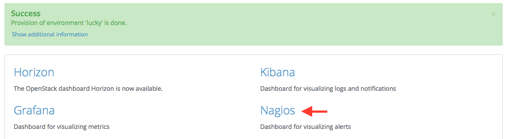
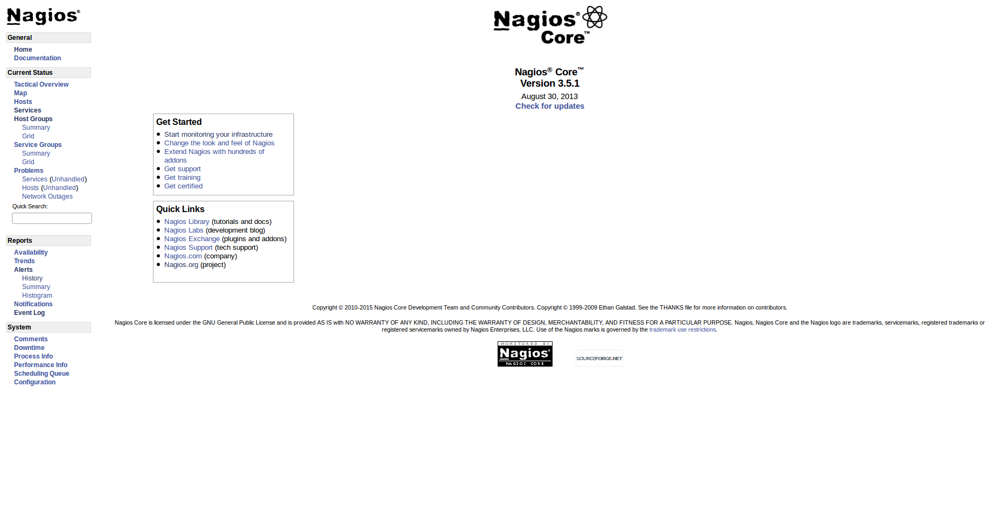

.. _user_guide:

User Guide
==========

.. _plugin_configuration:

Plugin configuration
--------------------

To configure your plugin, you need to follow these steps:

#. `Create a new environment <http://docs.mirantis.com/openstack/fuel/fuel-7.0/user-guide.html#launch-wizard-to-create-new-environment>`_
   with the Fuel web user interface.

#. Click on the Settings tab of the Fuel web UI.

#. Scroll down the page and select the LMA Infrastructure Alerting Plugin in the left column.
   The LMA Infrastructure Alerting Plugin settings screen should appear as shown below.

   .. image:: ../images/lma_infrastructure_alerting_settings.png
      :width: 800
      :align: center

#. Select the LMA Infrastructure Alerting Plugin checkbox and fill-in the required fields.

   * Change the nagiosadmin password (optional).

   * Specify the recipient email address for the alerts.

   * Specify the sender email address for the alerts.

   * Specify the SMTP server address and port.

   * Specify the SMTP authentication method.

   * Specify the SMTP username and password (required if the authentication method isn't 'None').

   * Specify which types of notification should be sent by email.

#. Assign the *LMA Infrastructure Alerting* role to a node as shown in the figure below.

   .. image:: ../images/lma_infrastructure_alerting_role.png
      :width: 800
      :align: center

#. Please take into consideration the information on the disks partitioning.
   By default, the LMA Infrastructure Alerting Plugin allocates:

    - 20% of the first available disk for the operating system by honoring a range of 15GB minimum and 50GB maximum.
    - 10GB for */var/log*.
    - At least 20 GB for the Nagios data in */var/nagios*.

   Please check the `Fuel User Guide <http://docs.mirantis.com/openstack/fuel/fuel-7.0/user-guide.html#disk-partitioning>`_
   if you would like to change the default configuration of the disks partitioning.

#. `Configure your environment <http://docs.mirantis.com/openstack/fuel/fuel-7.0/user-guide.html#configure-your-environment>`_
   as needed.

#. `Verify the networks <http://docs.mirantis.com/openstack/fuel/fuel-7.0/user-guide.html#verify-networks>`_ on the Networks tab of the Fuel web UI.

#. `Deploy <http://docs.mirantis.com/openstack/fuel/fuel-7.0/user-guide.html#deploy-changes>`_ your changes.

.. _plugin_install_verification:

Plugin verification
-------------------

Be aware, that depending on the number of nodes and deployment setup,
deploying a Mirantis OpenStack environment can typically take anything
from 30 minutes to several hours. But once your deployment is complete,
you should see a notification that looks like the following:

Once your deployment has completed, you should verify that Nagios is
installed properly through checking its URL::

    http://<HOST>:8001/

Where *HOST* is the IP address of the node which runs the Nagios server.

.. note:: You can retrieve the IP address where Nagios is installed using
   the `fuel` command line::

    [root@fuel ~]# fuel nodes
    id | status   | name             | cluster | ip        | mac                ....
    ---|----------|------------------|---------|-----------|------------------- ....
    14 | ready    | Untitled (20:0c) | 8       | 10.20.0.8 | 08:00:27:29:20:0c  ....
    13 | ready    | Untitled (47:b7) | 8       | 10.20.0.4 | 08:00:27:54:47:b7  ....

    ... | roles                       | pending_roles | online | group_id
    ... |-----------------------------|---------------|--------|---------
    ... | controller                  |               | True   | 8
    ... | lma_infrastructure_alerting |               | True   | 8

Once you have authenticated to the Nagios UI (the username is ``nagiosadmin`` and the
password is defined in the settings of the plugin), you should get to this
page:

Managing Nagios
---------------

You can get the current status of the OpenStack environment by clicking on
the *Services* menu item:

.. image:: ../images/nagios_services.png
   :align: center
   :width: 900

The LMA Infrastructure Alerting plugin has provisioned Nagios with all the
hosts and services that have been deployed in the environment. The alarms (or
service checks in Nagios vocabulary) are configured in passive mode because
they are received from the LMA collectors and aggregator (see the `LMA
Collector documentation <http://fuel-plugin-lma-collector.readthedocs.org/>`_
for more details).

.. note:: Notifications for system and node  cluster alarms are disabled by
   default because they can be triggered often while not affecting the overall
   health of the OpenStack services. If you want to enable notifications for a
   particular service, go to the service's details page and click on the 'Enable
   notifications for this service' link in the 'Service Commands' panel.

There are also two *virtual* hosts representing the service and node clusters:

* *00-global-clusters-env${ENVID}* for the service clusters like the Nova
  cluster, the Keystone cluster, the RabbiMQ cluster and so on.

* *00-node-clusters-env${ENVID}* for the physical node clusters like the
  cluster of controller nodes, the cluster of storage nodes and so on.

These additional 2 entities offer the high-level view on the healthiness of the
OpenStack environment.

Troubleshooting
---------------

If you cannot access the Nagios UI, check the following:

#. Check if the nodes are able to connect to the Nagios server on port *8001*.

#. Check the Nagios configuration is valid::

    [root@node-13 ~]# nagios3 -v /etc/nagios3/nagios.cfg

       [snip]

    Total Warnings: 0
    Total Errors:   0

    Things look okay - No serious problems were detected during the pre-flight check

#. Check that the Nagios server is up and running::

    [root@node-13 ~]# /etc/init.d/nagios3 status

#. If Nagios is down, start it::

    [root@node-13 ~]# /etc/init.d/nagios3 start

#. Check if Apache is up and running::

    [root@node-13 ~]# /etc/init.d/apache2 status

#. If Apache is down, start it::

    [root@node-13 ~]# /etc/init.d/apache2 start

If Nagios reports some hosts or services as 'UNKNOWN: No data received for at
least X seconds ', it indicates that the LMA collector fails to communicate
with the Nagios service:

#. First, check that the LMA Collector is running properly on these nodes
   by following the troubleshooting instructions of the
   `LMA Collector Fuel Plugin User Guide <http://fuel-plugin-lma-collector.readthedocs.org/en/latest/user/configuration.html#troubleshooting>`_.

#. Check if the nodes are able to connect to the Nagios server on port *8001*.

If Nagios reports some hosts or services as 'UNKNOWN: No datapoint have been
received ever' or 'UNKNOWN: No datapoint have been received over the last X
seconds ', it indicates that the LMA collector fails to determine the status of
the service because either the alarm rule is misconfigured or no metric is
received. In both cases, follow the the troubleshooting instructions of the
`LMA Collector Fuel Plugin User Guide <http://fuel-plugin-lma-collector.readthedocs.org/en/latest/user/configuration.html#troubleshooting>`_.
